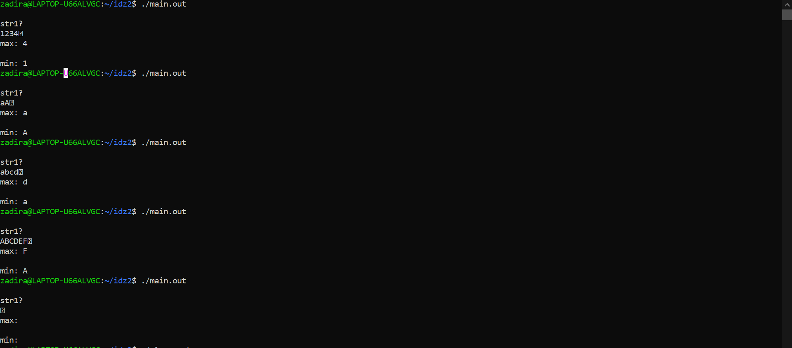
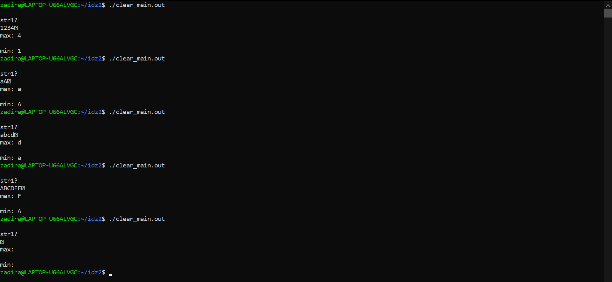
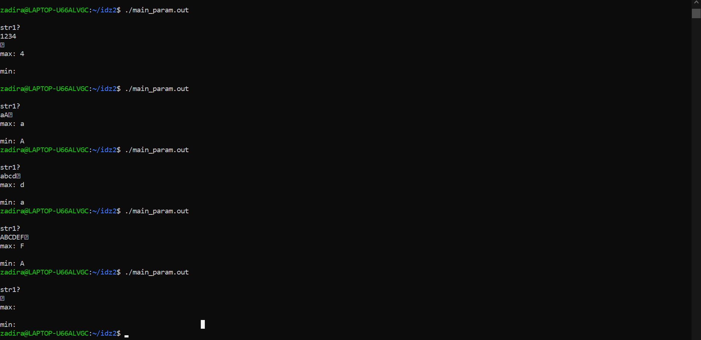
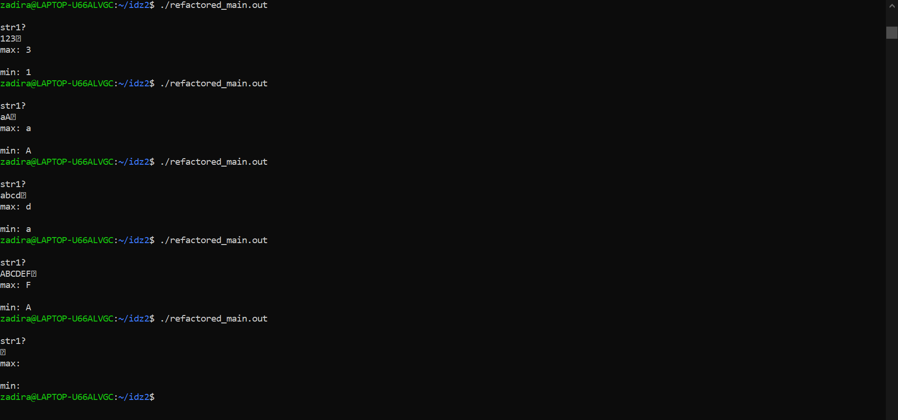

# Отчет ИДЗ 2

## Парахин Николай Викторович

## БПИ 212

&nbsp;

### Вариант 12

__Условие:__
 Разработать программу, определяющую минимальный и максимальный (по числовому значению) символ в заданной ASCII-строке.


## На 4 балла

Мною была написана программа на С:

### main.c

``` C
#include <stdio.h>
#include <termios.h>
#include <unistd.h>

int mygetch( ) {
    struct termios oldt,
    newt;
    int ch;
    tcgetattr( STDIN_FILENO, &oldt );
    newt = oldt;
    newt.c_lflag &= ~( ICANON | ECHO );
    tcsetattr( STDIN_FILENO, TCSANOW, &newt );
    ch = getchar();
    tcsetattr( STDIN_FILENO, TCSANOW, &oldt );
    return ch;
}

char* get_string(char* str) {
    int i = 0;
    int ch;
        do {
            ch = mygetch();
            putc(ch, stdout);
            str[i++] = ch;
        } while(ch != 4);   // break -- Ctrl+D
    str[i] = '\0';
    return &str[i+1]; // Первый свободный байт
}

void get_chars(char* str) {
    int i = 0;
    char min;
    int min_int = 130;
    char max;
    int max_int = -1;
    int code;
    while (str[i] != '\0') {
        code = (int)str[i];
        if (code < min_int && code != 4) {
            min = str[i];
            min_int = code;
        }
        if (code > max_int && code != 4) {
            max = str[i];
            max_int = code;
        }
        i++;
    }
    printf("\nmax: %c\n", max);
    printf("\nmin: %c\n", min);
}

int main() {
    char str[10000];
    char* str1 = str;
    puts("\nstr1? ");
    get_string(str1);
    get_chars(str1);
    return 0;
}
```

P.S. : Код делал сразу для решения на 5.

P.S.2 : При тестовых прогонах виден символ с вопросиком. Это '\0', который означает конец строки и просто не отображается.

P.S. 3: В процессе отладки заметил, что если ввести 'ENTER', то он тоже будет отображаться как невидимый символ.

1) Использовал команду __gcc -S -O0 main.c__, чтобы создать ассемблерыный файл main.s без оптимизирующих и отладочных операций.
Чтобы не было этих операций, использовал в строке ключ -O0.
2) Использовал команду __gcc -O0 -Wall -masm=intel -S -fno-asynchronous-unwind-tables -fcf-protection=none main.c -o clear_main.s__, чтобы модифицировать программу, убрать макросы.
3) Использовал команды __gcc -O0 main.s -o main.out__ и __gcc -O0 clear_main.s -o clear_main.out__, чтобы создать исполняемые файлы __main.out__ и __clear_main.out__ c флагом -O0.
4) Мною были созданы текстовы файлы-тесты для тестирования программы (for4/tests). Провел тесты на двух программах. Заметно, что результат выполнения эквивалентен:


__Вывод:__ Программы дают одинаковый результат на данных тестах.
Список модификаций: Использовав команду с __-Wall -masm=intel -S -fno-asynchronous-unwind-tables -fcf-protection=none__ ушли макросы .cfi, которые служили для отладночной информации.
Я использовал команду __cat main.s | awk '/^\t./ { print \$ 1 }' | sort | uniq > main_macros.txt__ и __cat clear_main.s | awk '/^\t./ { print \$ 1 }' | sort | uniq > clear_main_macros.txt__, чтобы понять, какие макросы ушли.

__Дополнение:__
Мною были проведены еще ряд махенаций с программой через ключи.
Если использовать команду __gcc -O2 -flto -Wall -masm=intel -S -fno-asynchronous-unwind-tables -fcf-protection=none main.c -o giga_clear_main.s__ то можно избавиться от большинства макросов (__gcc -O2 -flto -Wall -masm=intel -S -fno-asynchronous-unwind-tables -fcf-protection=none main.c -o giga_clear_main.s__).

Описание переменных смотри в main.s в директории for4.

## На 5 баллов

P.S. Программа на 4 и на 5 одинаковы, т.к. я решил сразу писать программу с отдельным методом.

1) Написал программу с функцией get_chars, которая принимает в параметры поинтер на массив с char-ами.

```C
#include <stdio.h>
#include <termios.h>
#include <unistd.h>

int mygetch( ) {
    struct termios oldt,
    newt;
    int ch;
    tcgetattr( STDIN_FILENO, &oldt );
    newt = oldt;
    newt.c_lflag &= ~( ICANON | ECHO );
    tcsetattr( STDIN_FILENO, TCSANOW, &newt );
    ch = getchar();
    tcsetattr( STDIN_FILENO, TCSANOW, &oldt );
    return ch;
}

char* get_string(char* str) {
    int i = 0;
    int ch;
        do {
            ch = mygetch();
            putc(ch, stdout);
            str[i++] = ch;
        } while(ch != 4);   // break -- Ctrl+D
    str[i] = '\0';
    return &str[i+1]; // Первый свободный байт
}

// метод по поиску максимального и минимального
// по коду символа
void get_chars(char* str) {
    int i = 0;
    char min;
    int min_int = 130;
    char max;
    int max_int = -1;
    int code;
    while (str[i] != '\0') {
        code = (int)str[i];
        if (code < min_int && code != 4) {
            min = str[i];
            min_int = code;
        }
        if (code > max_int && code != 4) {
            max = str[i];
            max_int = code;
        }
        i++;
    }
    // вывод максимального по коду символа
    printf("\nmax: %c\n", max);
    // вывод минималььного по коду символа
    printf("\nmin: %c\n", min);
}

int main() {
    char str[10000];
    char* str1 = str;
    puts("\nstr1? ");
    get_string(str1);
    get_chars(str1);
    return 0;
}

```

2) Использовал локальные переменные в функции main и в функции get_chars, в которую через параметр можно передать указатель на массив char-ов.

3) Использовал команду __gcc -O0 -Wall -masm=intel -S -fno-asynchronous-unwind-tables -fcf-protection=none main_param.c -o main_param.s__ чтобы получить ассемблерный код (смотри директорию for5).

4) Провел тестирования:

Видно, что работа программы аналогична работе предыдущих.

5) В файле main_param.s есть описание всех нужных параметров функций и связи их с регистрами.
P.S. В директориях есть папка tests c тестами.

## На 6 баллов

Мною был модифицирован код. Использовал регистры r12d для замены в счетчике и r13d в счетчике, чтобы программа работала быстрее.

Название файла - refactored_main.s

DWORD PTR -16[rbp] -> r13d

DWORD PTR -8[rbp] -> r12d

Видно, что программа работает на тестах валидно:


Кол-во строк в файле 268
Кол-во строк в main.s (аналог clear_main.s, но с комментариями): 268

# Спасибо!
